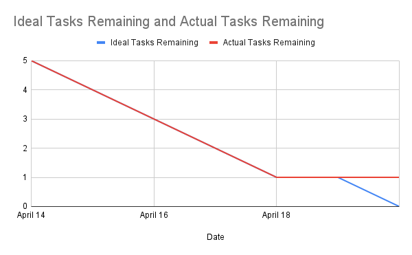

# Project-CS180

# Team Name: TeamOne 
## Team Members:
---
- Het Patel
- Dylan Talmood
- Jeffrey Dominguez
- Brandon Nguyen
- Miguelangel Tinoco

## Technologies:
---
- **Interface:** Terminal Application
- **Language:** Python
  
## Current Features:
---
    1. Create Record
    2. Read Record
    3. Update Record
    4. Delete Record
    5. List Record
    6. Quit
## Planned Features
---
    1. Option to have multiple record files
    2. Search for files
    3. Delete entire record files
    4. import and export record files 
    5. Create new databases
    6. Delete databases
    7. import/export databases

## Getting Started:
---
The `main.py` file can act as an entry script. The file can be run in the IDE of your choice, in a text editor like VSCode(using extension like code runner) or it can be ran in a terminaly buy using the command `python main.py`

## Burndown Chart: 
---

